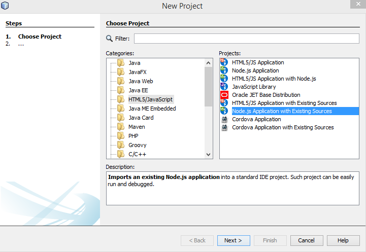
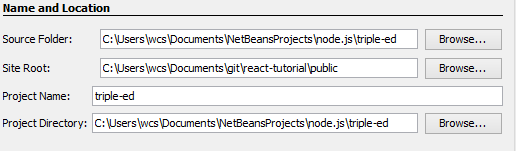

# My way to build a _react_ app using NetBeans


## 1. Install _create-react-app_

I installed _create-react-app_ following the [
description](https://github.com/facebook/create-react-app/blob/master/packages/react-scripts/template/README.md)

## 2. Scaffolding
My project name is _triple-ed_, so I typed in console

```
create-react-app triple-ed
```
It took one minute to get ready. The result was npm package folder.

## 3. Start
```
cd triple-ed
npm start
```
__Super__, it works.

## 4. Create a NetBeans Project
New project

Options


Finished. It works fine. I can run the npm script _start_ in NetBeans, the browser opens the demo app.

## 5. Start Work
When I change _App.js_ and save it, the changes are visible in browser. If I make an error, it will be described in browser.

I am abel to write TypeScript and to use all the fine node.js modules.
The first one I installed was [reactstrap](https://reactstrap.github.io/) to use bootsrtap classes.

It feels good, to make web pages as a program. Thank's to all the people that make this possible.
